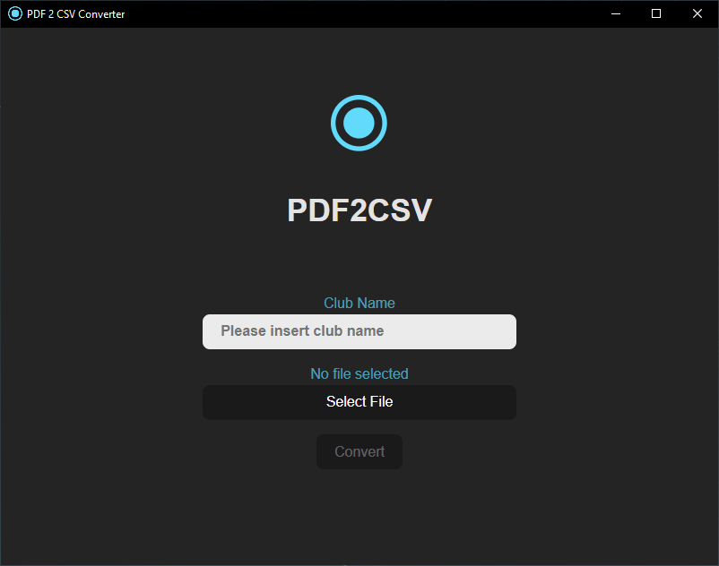

# 🏊‍♂️ PDF 2 CSV Converter 
_This tool is experimental and not yet finished._

## 📝 Description
This is a simple tool to convert PDF files to CSV files with a simple GUI.
The tool is based on the [PDF to CSV Converter](https://github.com/Asepsis/pdf_to_csv_converter). 
Since this tool is just the [PDF to CSV Converter](https://github.com/Asepsis/pdf_to_csv_converter) with a GUI ontop, it has the same dependencies like the CLI version. 



### 🔃 Dependencies
The main Branch will convert meldeergebnis from EasyWK to a CSV file.

This is pretty specific and only works propably with meldeergebnis from EasyWK.

<details>
  <summary>🔍 Some Details</summary>
  
  `Competitions`(Wettkampf) have to look like one of the following in order to get parsed correctly:
  
  ```txt
  Wettkampf 56 - 200m Freistil weiblich
  noch Wettkampf 57 - 200m Freistil männlich
  ```

  The headline from a `Lauf`(Run) have to look like the following example in order to get parsed correctly:
  
  ```txt
  Lauf 5/12 (ca. 18:52 Uhr)
  ```

  The following Block shows how a `Bahn` can look like to get parsed correctly for junior and master:
  
  #### 👦👧 Junior
  ```txt
    Bahn 1
    Bahn 2 Elias Lastname  2007 Swim-Team 02:24,19
    Bahn 3 Francesco Lastname  2008 Swim-Team 02:22,53
    Bahn 4 Maximilian Lastname  2006 Swim-Team 02:21,48
    Bahn 5 Luis Lastname  2008 Swim-Team 02:22,13
    Bahn 6 Marcell Lastname  2008 Swim-Team 02:22,94
    Bahn 7
    Bahn 8 Jona Lastname  2007 Swim-Team 02:25,13
  ```
  #### 👵🧓 Master
  ```txt
  Bahn 1 Linda Lastname  1983/AK 35 Swim-Team 01:15,00
  Bahn 2 Danae Lastname  1989/AK 30 Swim-Team 01:19,00
  Bahn 3 Birte Lastname  1989/AK 30 Swim-Team 01:20,00
  Bahn 4 Karin Lastname  1995/AK 25 Swim-Team 01:06,10
  Bahn 5 Vanessa Lastname  1997/AK 25 Swim-Team 01:14,96
  Bahn 6 Antonia Lastname  2001/AK 20 Swim-Team 1873  01:19,37
  Bahn 7 Sarah Lastname  2002/AK 20 Swim-Team 1873  01:26,93
  Bahn 8
  ```    
  
</details>

## 📚 Documentation
How to use the tool:
1. Just enter the club name you want to look up
2. Select a file to convert to a csv file
3. Press the convert button

## ⚙ Technical Details
The Frontend is based on [Tauri](https://tauri.app/) with the [React](https://reactjs.org/) framework.
The Backend is based on [Rust](https://www.rust-lang.org/).
Preferences like the club name will be saved in a local storage. For example in windows it will be saved under: `C:\Users\Username\AppData\Roaming\PDF 2 CSV Converter\pdf2csv`